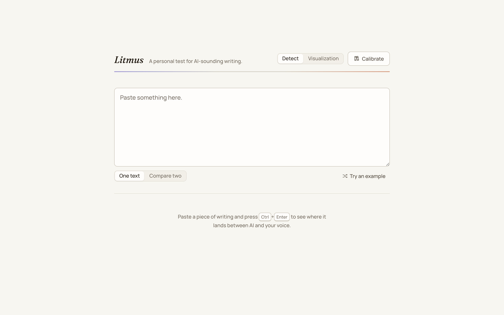
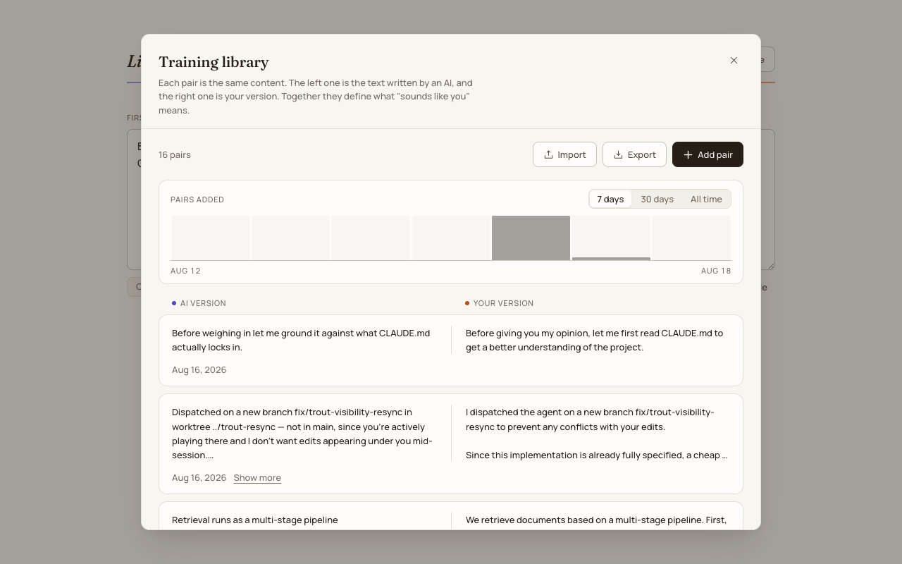
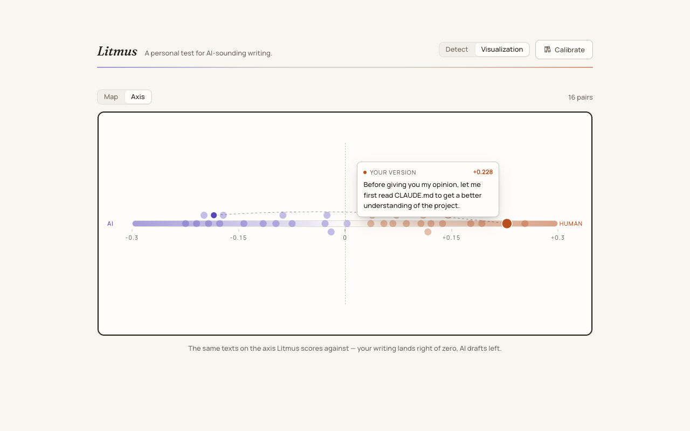

# Litmus

Litmus tells you whether text sounds like you, or like an AI wrote it. You feed it pairs of texts: an AI draft, and how you'd actually write it. Positive means it sounds like you. Negative means it sounds like a machine.

## What it does

You use Litmus in a few simple steps. First, you paste in a text and get a score, or paste two and see which one sounds more like you. Each sentence is faintly shaded by how it reads on its own, so you can see which parts lean which way; the score is still read off the whole text, for the reasons in [docs/sentence-scoring.md](docs/sentence-scoring.md). Then you manage the AI/human pairs the score is learned from, newest first — and the play button on a pair sends it straight to the detector, where the two versions land side by side already scored. You need at least 2 pairs. Finally, you can plot your whole library on a 2D map.







## Quickstart

```bash
git clone <repo-url> litmus
cd litmus
echo "OPENROUTER_API_KEY=sk-or-..." > .env
python3 -m venv .venv && .venv/bin/pip install -r backend/requirements.txt
python run.py
```

run.py builds the frontend if needed, then serves everything on http://127.0.0.1:8000. Add --no-browser to run headless, or --dev for Vite on :5173 with hot reload.

From backend/, run uvicorn, then pytest in another terminal. From frontend/, run npm install, then npm run dev. For deploying it somewhere, see DEPLOY.md.
