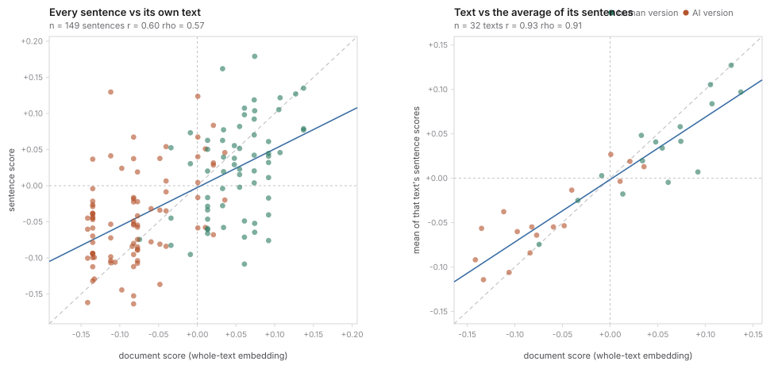

# Should Litmus score sentences instead of whole texts?

Litmus embeds a text once and projects that single vector onto the learned
human–AI axis. The obvious alternative is to split the text into sentences,
score each one, and combine them. That would be attractive for two reasons: it
would say *which* parts of a text read as AI, and — if aggregation were smarter
than a single embedding — it might separate the two classes better.

It does not separate better. Whole-text scoring wins, and the reason is
measurable. What sentence scores are good for is showing the user where a text
leans, which is what the Detect view now does with them.

Scripts: `backend/experiments/sentence_scoring.py` (separation) and
`backend/experiments/sentence_vs_doc.py` (correlation). Both run from the cached
embeddings in `embedding_cache.json`, so a rerun costs nothing.

## Setup

- **Dataset**: the live library in `backend/data/app.db` — 16 AI/human pairs,
  32 texts, 149 sentences. Median 4 sentences per text, longest 20.
- **Model**: `openai/text-embedding-3-small` at 1536 dimensions, the production
  model and size.
- **Protocol**: leave-one-pair-out. Each pair is held out in turn, the axis is
  learned from the remaining 15 exactly as `scoring.learn_direction` does
  (average AI→human step, midpoint centred), and both held-out texts are
  scored. Nothing from a held-out pair enters its own fit.
- **Splitting**: `scoring.sentence_spans` — split after sentence punctuation,
  merging fragments under 15 characters into their neighbour, because very
  short fragments embed unstably.

Metrics on the pooled held-out scores: **LOO ROC-AUC** (the probability that a
random human text outscores a random AI text) with a 95% CI bootstrapped over
pairs; **d'** as an effect size; **paired accuracy** (how often a pair's human
version beats its own AI version, which is what the product shows a user); and
**gains/losses**, the number of the 256 human-vs-AI comparisons that flip
relative to whole-text, with a sign test on the discordant ones.

Two ways of getting the axis were tried, because the axis and the units being
scored need not live in the same space:

- **doc-axis** — the production axis, learned from whole-text embeddings. Only
  the thing being projected changes.
- **sent-axis** — human-sentence centroid minus AI-sentence centroid over the
  training pairs' sentences, midpoint centred.

## Separation: 19 aggregation rules, none of them better

| method | LOO AUC | 95% CI | d' | paired acc | +/− vs base | sign p |
| --- | --- | --- | --- | --- | --- | --- |
| **whole-text (production)** | **0.926** | 0.86 – 0.99 | 2.05 | 100% | – | – |
| doc-axis, top-50% extreme | 0.918 | 0.84 – 0.99 | 1.95 | 100% | +5/−7 | 0.77 |
| doc-axis, rank-linear | 0.898 | 0.82 – 0.98 | 1.72 | 100% | +3/−10 | 0.09 |
| doc-axis, top-3 extreme | 0.895 | 0.80 – 0.98 | 1.81 | 94% | +3/−11 | 0.06 |
| doc-axis, \|s\|-weighted | 0.887 | 0.81 – 0.97 | 1.72 | 100% | +2/−12 | 0.01 |
| doc-axis, mean | 0.871 | 0.76 – 0.96 | 1.64 | 94% | +3/−17 | 0.003 |
| doc-axis, trimmed mean | 0.871 | 0.76 – 0.96 | 1.67 | 94% | +3/−17 | 0.003 |
| doc-axis, median | 0.867 | 0.75 – 0.96 | 1.47 | 94% | +6/−21 | 0.006 |
| doc-axis, min (worst line) | 0.850 | 0.76 – 0.95 | 1.43 | 94% | +4/−24 | <0.001 |
| doc-axis, length-weighted | 0.836 | 0.73 – 0.95 | 1.47 | 94% | +3/−26 | <0.001 |
| doc-axis, top-1 extreme | 0.785 | 0.69 – 0.90 | 1.01 | 94% | +5/−41 | <0.001 |
| sent-axis, best (softmax T=0.1) | 0.852 | 0.77 – 0.96 | 1.36 | 100% | +6/−25 | 0.001 |
| sent-axis, worst (max) | 0.758 | 0.63 – 0.89 | 0.92 | 81% | +4/−47 | <0.001 |

The full 39-row table, including position-weighted and softmax variants, is in
`sentence_scoring_results.json`.

What it says:

- **Nothing beats whole-text.** The best sentence variant ties it and loses more
  comparisons than it gains; 33 of the 38 variants are significantly worse. And
  the tie was picked as the best of 38 rules evaluated on the same 16 pairs, so
  even it is flattered by selection.
- **Averaging is not free.** Plain mean drops 0.055 AUC (+3/−17 flips,
  p = 0.003).
- **Length weighting is consistently the worst weighting.** Short, punchy
  sentences carry a lot of the voice signal; weighting by length mutes exactly
  those.
- **Betting on one sentence collapses.** top-1, min and max are the weakest
  rules in the table, so the intuitive "a text is only as human as its worst
  line" framing does not hold.
- **Learning the axis in sentence space is worse** than reusing the whole-text
  axis (0.852 vs 0.918 at best). Sentence centroids are a blurrier target than
  paired AI→human steps.
- On the 9 pairs where **both** versions have 3+ sentences — where splitting
  actually does something — whole-text pulls further ahead: 0.963 vs 0.926.

An earlier run of the same protocol on the 10-pair `examples.json` set
(`granular_detection.py`, `aggregation_sweep.py`) reached the same verdict
against a 0.820 baseline, so this is not an artifact of one dataset.

## Why: a sentence is a weak proxy for its text

|  | Pearson r | 95% CI | Spearman ρ | R² |
| --- | --- | --- | --- | --- |
| sentence vs its own text's score | +0.596 | +0.48 – +0.69 | +0.574 | 0.36 |
| text's mean sentence score vs its score | +0.926 | +0.85 – +0.96 | +0.912 | 0.86 |

- **55% of the variance in sentence scores is within texts, not between them.**
  More than half the spread is sentences disagreeing with each other inside one
  text. The mean within-text SD is 0.060 — about the size of the whole human–AI
  gap, so a single sentence sits roughly as far from its own text as the two
  classes sit from each other.
- **75% sign agreement**, and only **7 of 27** multi-sentence texts have all
  their sentences on the same side of zero. Most texts contain sentences that
  read as the wrong class.
- Sentence score vs sentence length: r = −0.055. The axis is not secretly
  reading length, which is why length weighting had nothing real to exploit.

The left panel shows this as vertical stacks — one per text — tall enough to
straddle zero even when the texts themselves separate cleanly. The right panel
collapses each stack to its mean and the points snap onto the diagonal.

That is the mechanism. Individual sentences are noisy (R² = 0.36); averaging
cancels most of that noise and recovers the document score almost exactly
(R² = 0.86). But "almost" is the ceiling: the best an aggregation can do is
*reconstruct* the number a single embedding already gives, minus the 14% it
loses on the way. The lost part is cross-sentence structure — rhythm,
transitions, sentence-length variance — which the whole-text embedding keeps and
the split throws away. That is the 0.926 → 0.871 drop for `mean`.

## What shipped

- **The score stays whole-text.** `scoring.score_text` projects the single
  document embedding, unchanged.
- **Sentence scores are shown, not summed.** Detect paints a faint tint behind
  each sentence, on the same axis as the score, so a reader can see where a
  text leans. They are a reading aid with a stated caveat, never a verdict: one
  sentence in four lands on the wrong side of zero, so a note under the boxes
  says the shading is per sentence and the score is how the overall text
  sounds.
- Sentences inside the too-close-to-call band (|score| < 0.02) get no tint at
  all, and a single-sentence text gets none either — there is nothing to
  compare it against.

## Caveats

- 16 pairs means one flipped comparison is worth 0.004 AUC, so AUC gaps under
  about 0.02 are not meaningful.
- The sign test treats the 256 comparisons as independent when each text appears
  in 16 of them, so its p-values are optimistic lower bounds. That only
  strengthens the negative result.
- Every number here is for one embedding model at one size. `embedding_dims.py`
  and `embedding_models.py` cover that axis.
